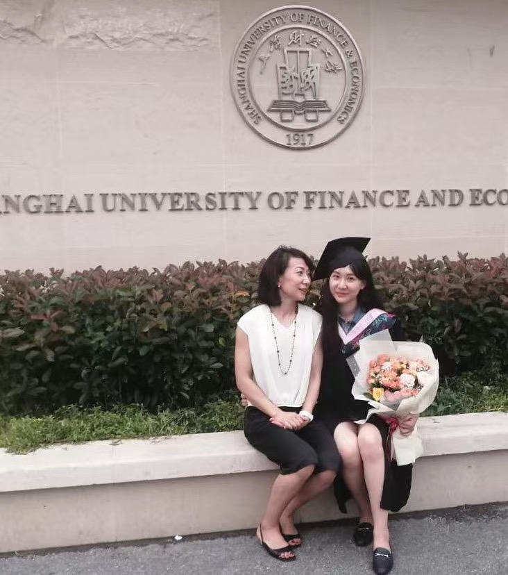

I gained my Bachelor degree in June, 2020 at Shanghai University of Finance and Economics. After that, I applied for and was luckily offered a place at the Global Master in Finance program which is jointly developed by London Business School and Fudan University. 

# Shanghai University of Finance and Economics
Major: Accounting
GPA: 3.8/4.0 (top5%)
Main courses: Strategic Business Reporting, Advanced Corporate Finance, Intermediate Macro-economics, Intermediate Micro-economics
Awards:  Shanghai Distinguished Graduate Award, People's Scholarship
Certificate: ACCA (11/13 passed)

{height=50%, width=50%}

#London Business School

