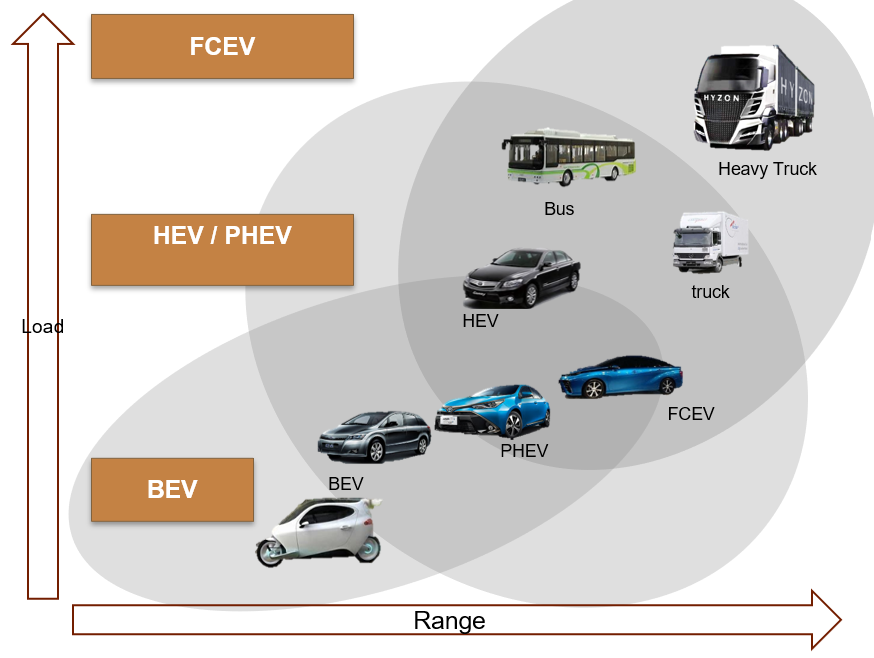

# **1.** On-demand delivery

## **1.1** What is on-demand delivery?

On-demand delivery refers to where the company responds to demands within hours. On-demand delivery started with take-away food delivery and is gradually extending to all categories including medicines, groceries etc. There are 3 reasons why this market is attractive.

## **1.2** Why is it an attractive business?

Firstly, the market is big. In 2019, the market size reached 141 bn RMB with 19.3 bn orders, and was expected to reach 1 trillion RMB in the next 10 years. On-demand delivery further expanded the coverage of offline stores by 3-5 kilometers. Such urban close-range e-commerce can effectively catch up with the changes in Chinese population.

{height=40%, width=40%}
{height=40%, width=40%}

Secondly, the profitability is attractive. For the industry of transportation, scale effect and barriers would generally decrease as the average weight of delivery units increase. The average net profit margin of Chinese Express Companies is around 8%, so we can expect on-demand delivery can enjoy a margin higher than 8% in the future.

{height=80%, width=80%}

Thirdly, the economics of scale works perfectly in the transportation industry, so does in the on-demand delivery. So, top players can develop advantages based on their existing leading positions and occupy more market shares.

# **2.** Fuel Cell Vehicles

## **2.1** What is Fuel Cell Vehicles?

A fuel cell vehicle (FCV) or fuel cell electric vehicle (FCEV) is an electric vehicle that uses a fuel cell to power its onboard electric motor. Fuel cells in vehicles generate electricity generally using oxygen from the air and compressed hydrogen. Most fuel cell vehicles are classified as zero-emissions vehicles that emit only water and heat. 

## **2.2** Potential Application
Fuel cell vehicles are more suitable for long-distance transportation, while pure electric vehicles are more suitable for medium-distance and short-distance transportation within cities.

### Lithium-ion battery vehicle

**Development status**: It is taking the lead in forming a large-scale market, with the maximum mileage reaching 500km at present.But the minimum battery charging time is about 30 minutes, and the space for optimization is limited.

**Suitable for urban, short-distance, passenger vehicles and other fields** :

(1) passenger vehicles have no fixed driving path and need dense electric pile interface, while the efficiency of electric transport link is higher than that of gasoline and hydrogen physical transport.

(2) Good user experience: The industry chain of lithium battery technology has been relatively mature

{height=80%, width=80%}

### Hydrogen fuel cell vehicles

**Development status**: Industrialization process is obviously later than lithium-ion battery ones.

**Suitable for commercial long-distance heavy-loaded transportations**:

(1) the energy density of hydrogen is about three times the gasoline diesel energy 

(2) quick tanking improves the operation of commercial vehicle efficiency

(3) although the volume of hydrogen energy density is low, space requirements are much more flexible for commercial vehicles 

(4) commercial vehicles tend to have fixed routes and operate in groups, which means just a limited number of hydrogen station would satisfy their needs

